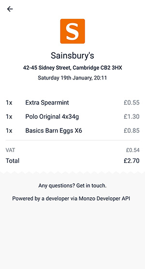

# Monzo Receipt Reader

## Results

This project won the Monzo Challenge at Hack Cambridge 4D in January 2019.

## What is it?
A receipt reader that analyses a photograph of a printed or handwritten receipt and extracts individual items, quantities and prices. A digital version is then generated and automatically attached to the transaction in the Monzo app.

## How does it work?
Click on the relevant transaction in the Monzo app, click *add receipt* and then upload a photograph of the receipt.

## Demo
### Step 1

### Step 2

### Step 3

## Technologies

We used Microsoft Azure's Vision API to get a raw text dump file. We then took the raw text dump and tried to analyse it line by line to find structure and patterns. We then extract each item (quantities, singular item prices, total item prices) and feed it into the Monzo API. 

The Monzo API refreshes at an interval to look for new attachments for transactions, runs it through the API and tabulates it into the receipt. This is done all natively and automatically through the Monzo app.

We also used Microsoft's Azure Vision API to add support for handwritten receipts, in case you're shopping at an old school shop.
